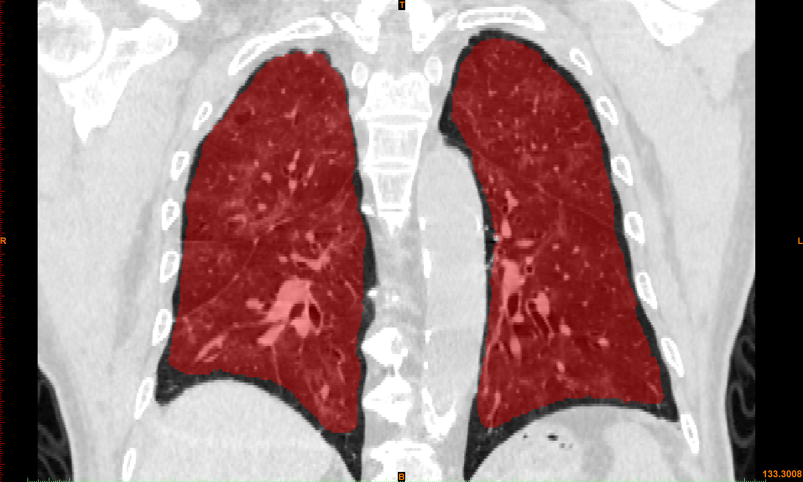

# COVID-SegNet
COVID-19 Chest CT Image Segmentation — A Deep Convolutional Neural Network Solution

Qingsen Yan, Bo Wang, Dong Gong, Shuo Jin, Chuan Luo, Wei Zhao, Jianhu Shen, Qinfeng Shi, Liang Zhang and Zheng You

## Overview
In this work, we try to establish a new deep convolutional neural network tailored for segmenting the chest CT images with COVID-19 infections. We firstly maintain a large and new chest CT image dataset consisting of 21,658 annotated chest CT images from 861 patients with confirmed COVID-19. Inspired by the observation that the boundary of the infected lung can be enhanced by adjusting the global intensity, in the proposed deep CNN, we introduce a feature variation block which adaptively adjusts the global properties of the features for segmenting COVID-19 infection. The proposed FV block can enhance the capability of feature representation effectively and adaptively for diverse cases. We fuse features at different scales by proposing Progressive Atrous Spatial Pyramid Pooling to handle the sophisticated infection areas with diverse appearance and shapes.

## The Annotated Dataset

## Dataset
URL：https://pan.baidu.com/s/1eid_Y99fxGCmWVsL2M-riQ 
Code：bt32
